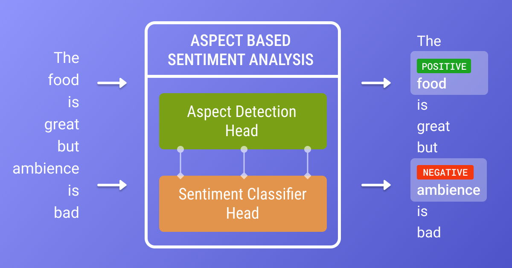

# Aspect-Based Sentiment Analysis

This repository contains code for Aspect-Based Sentiment Analysis (ABSA) using various models and techniques. The goal of ABSA is to extract opinions about specific aspects of products or services from text data.
